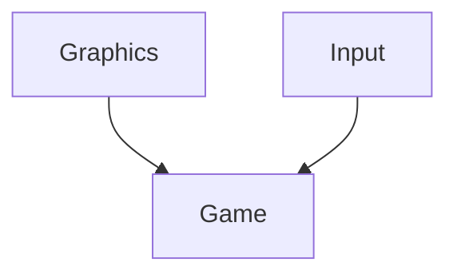

# SnakeProject

## Summary
This is a recreation of the classic game, Snake, within the .NET console. I could have used WinForms, MonoGame, or Unity but my goal was to learn how to code as much as possible from scratch. The biggest challenge of this project was the rendering. I used platform invoke to write directly to the native consoles buffer and used bit-shifting to allow changing of foreground and background colors for each on-screen character due to the CharAttributes being a mere short value.

### Gameplay Twist
The multiplier for score gained per food goes down every time the snake changes direction. This promotes more reactive and calculated play to achieve higher scores.

## Structure

I layered the project in a way that the Graphics and Input layers have one-way communication with the Game layer. That way, if I ever wanted to swap input or rendering systems, I could do so without touching any of the game’s logic.

## Some Words

I want to give a special thanks to RB Whitaker. I bought his book [The C# Player's Guide](https://www.amazon.com/C-Players-Guide-5th/dp/0985580151) shortly after derparting my 6+ year position in IT, and it provided for a fantastic and easy-to-digest entry into C#. 

As someone who is not the most social, I was even pulled into his Discord community where readers can ask questions and post their completed challenges from the book for review. He himself has spent over 2 ½ hours answering a single question of mine in more detail than I ever could have hoped for, and his passion clearly shows.
