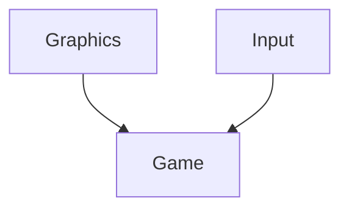

# SnakeProject

## Summary
This is a simple recreation of the classic game, Snake, within the .NET console. I could have used WinForms, MonoGame, or Unity but my goal was to learn how to code as much as possible from scratch. I enjoyed the challenges that came with it, such as figuring out how to use platform invoke calls to directly write to the native console’s buffer to speed up rendering.

### A twist
The multiplier for score gained per food goes down every time the snake changes direction. This promotes more reactive and calculated play to achieve higher scores.

## Structure

I layered the project in a way that the Graphics and Input layers have one-way communication with the Game layer. That way, if I ever wanted to swap input or rendering systems, I could do so without touching any of the game’s logic.

## Fun things
I used bit shifting in the renderer I created to allow for setting the background color of a char, the native console code uses a single short to facilitate all of the char's attributes.
